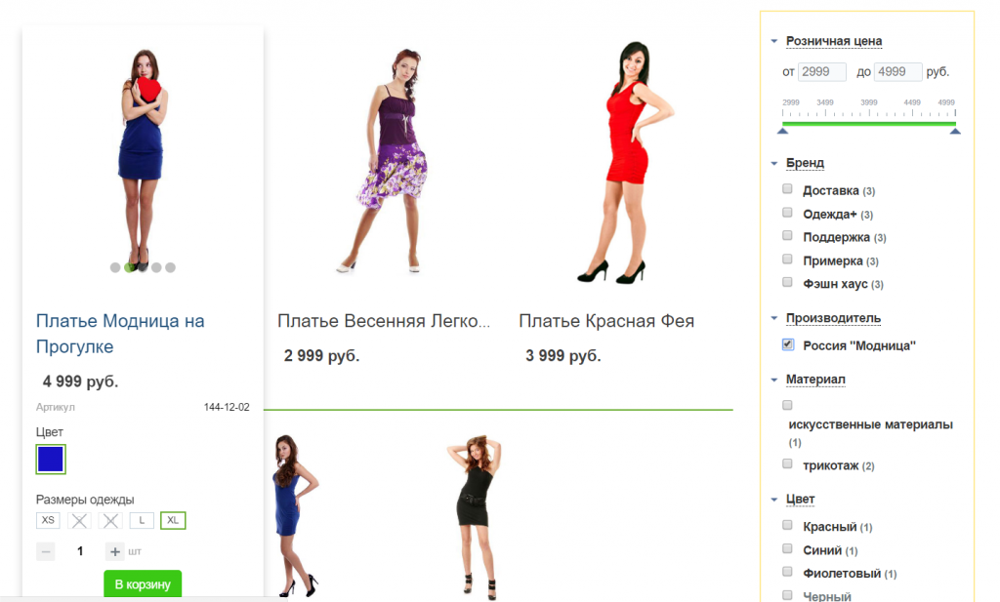

# Фильтрация без перезагрузки страницы (AJAX)

Для фильтрации без перезагрузки страницы существует специальный шаблон фильтра - ajax. Т.е. если вы хотите перейти на ajax, то в настройках компонента фильтра, нужно выбрать этот шаблон.
Но это не все, к сожалению. Вам придется самостоятельно написать код обработчика для обновления списка товаров. Так как у списка товаров на каждом сайте свой дизайн, могут быть "навешаны" различные обработчики событий, ajax-добавление в корзину и т.д., то вам придется самостоятельно все это обновлять, фильтр только даст вам новый html-код страницы. Но если вы знаете javascript, то все это не так уж и сложно, даже на самых "навороченных" сайтах у меня это не занимало больше 1 часа. А для стандартного демо-магазина это вообще всего пара строк кода!

Рассмотрим как все это сделать на примере демо-сайта интернет магазина 1С-Битрикс. Будем считать что kombox-фильтр на сайте уже установлен и настроен. Для этого есть отдельная инструкция - http://filter.kombox.ru/docs/course/?COURSE_ID=1&amp;CHAPTER_ID=03

Наш фильтр работает, фильтрует товары, но для этого нам нужно каждый раз нажимать кнопку "Показать", а мы хотим чтобы все было сразу, выбрал свойство - получил результат. И так поехали!

Для начала меняем шаблон компонента фильтра на ajax. Так же, чтобы не отправлять весь html-код страницы будем обрезать его. Для этого в файле шаблона каталога section_vertical.php в верху файла, до подключения компонента фильтра добавляем такой код:

```php
<?
$ajax = $_POST['filter_ajax'] == 'y';
 if($ajax)$APPLICATION->RestartBuffer();
?>
```

А в самом низу добавляем:

```php
<?
if($ajax)die();
?>
```

Затем нам нужно написать код обработчика. Код можно разместить в любом удобном месте, главное чтобы он подключался на странице. Я же буду его писать прям в шаблоне каталога, для простоты и наглядности. Так же я буду использовать jquery, хотя в случае демо-магазина это не обязательно, но уверен, для вашего сайта jquery будет нужен, тем более он уже подключен, так как шаблоны фильтра его используют.
Для начала сделаем просто обновление html списка каталога. Размещаем код скрипта в конце файла section_vertical.php, после нашего кода кода с die():

```html
<script>
BX.ready(function(){
	BX.addCustomEvent("onKomboxFilterCatalogLoading", BX.delegate(function(data){
		var $data = $('<div>' + data + '</div>');
		var content = $data.find('.catalog-section[data-entity="container-1"]');
		var cur_content = $('.catalog-section[data-entity="container-1"]');
		cur_content.replaceWith(content);
		
		//учтем постраничку
		var pager = $('div[data-pagination-num]', $data);
		var cur_pager = $('div[data-pagination-num]');
		
		if(pager.length){
			if(cur_pager.length)
			{
				cur_pager.replaceWith(pager).show();
			}
			else
			{
				content.after(pager);
			}
		}
		else if(cur_pager.length){
			cur_pager.hide();
		}
	}, this));
});
 </script>
```

Пробуем фильтровать, список товаров обновляется через ajax, все хорошо, но сами товары отображаются не корректно, не выделяются при наведении курсора, нельзя добавить в корзину, поменять цвет и т.д. Это то о чем я писал выше, мало просто обновить список товаров, нужно еще учесть нюансы дизайна конкретного сайта.


Теперь нам нужно доработать наш обработчик, чтобы применить все необходимые скрипты. В стандартных шаблонах js-код вызывается сразу в шаблонах, поэтому в данном случае наша задача сильно упрощается, нам всего лишь нужно найти эти скрипты и выполнить их. Теперь наш обработчик будет таким:

```html
<script>
 BX.ready(function(){
	BX.addCustomEvent("onKomboxFilterCatalogLoading", BX.delegate(function(data){
		var $data = $('<div>' + data + '</div>');
		var content = $data.find('.catalog-section[data-entity="container-1"]');
		var cur_content = $('.catalog-section[data-entity="container-1"]');
		cur_content.replaceWith(content);
		
		//учтем постраничку
		var pager = $('div[data-pagination-num]', $data);
		var cur_pager = $('div[data-pagination-num]');
		
		if(pager.length){
			if(cur_pager.length)
			{
				cur_pager.replaceWith(pager).show();
			}
			else
			{
				content.after(pager);
			}
		}
		else if(cur_pager.length){
			cur_pager.hide();
		}
		
		//выполним скрипты
		var ob = BX.processHTML(data);
		BX.ajax.processScripts(ob.SCRIPT);
	}, this));
});
 </script>
```

И список товаров теперь отображается после фильтрации правильно:



На этом переход на ajax можно считать оконченным!