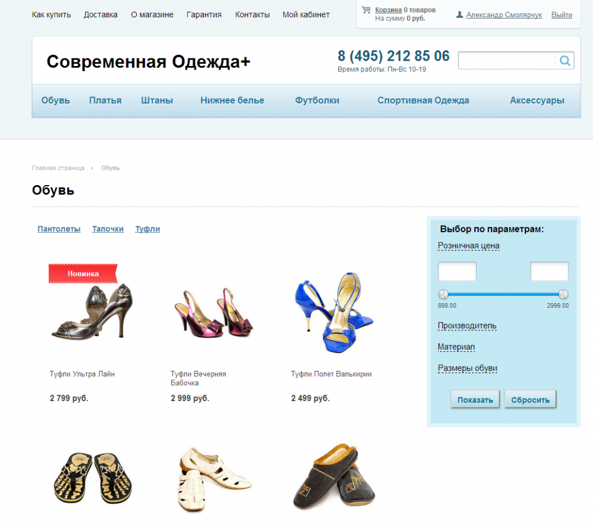
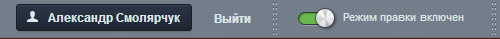
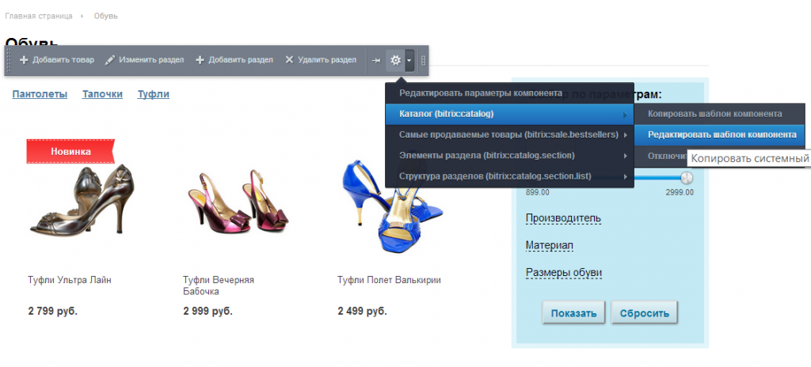
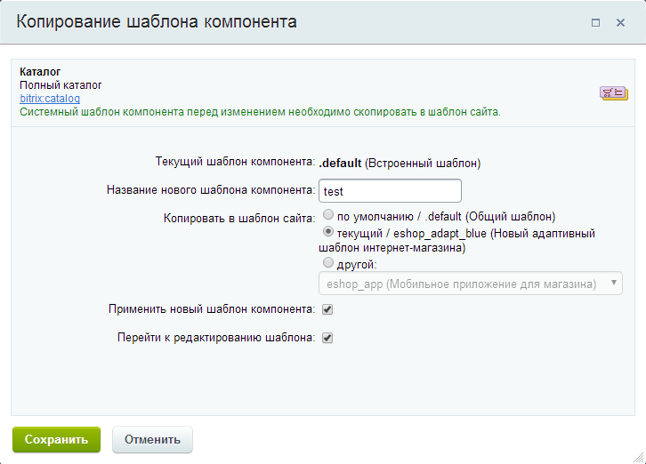
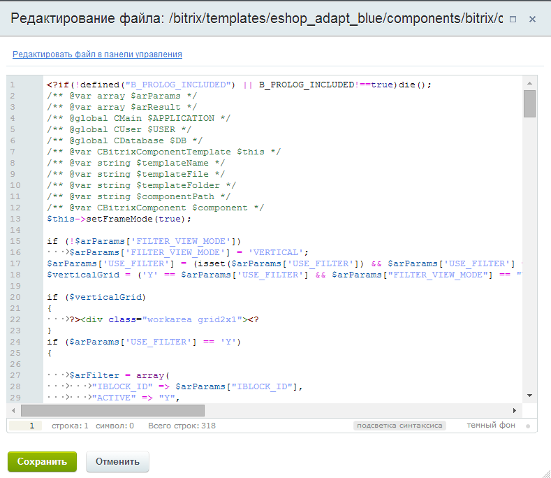
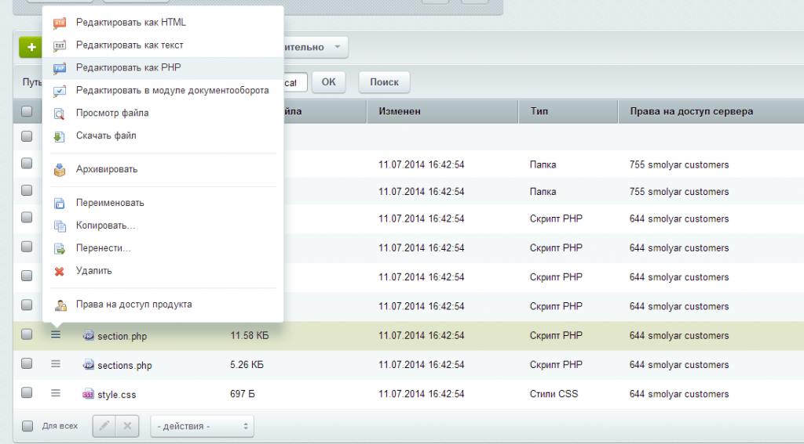
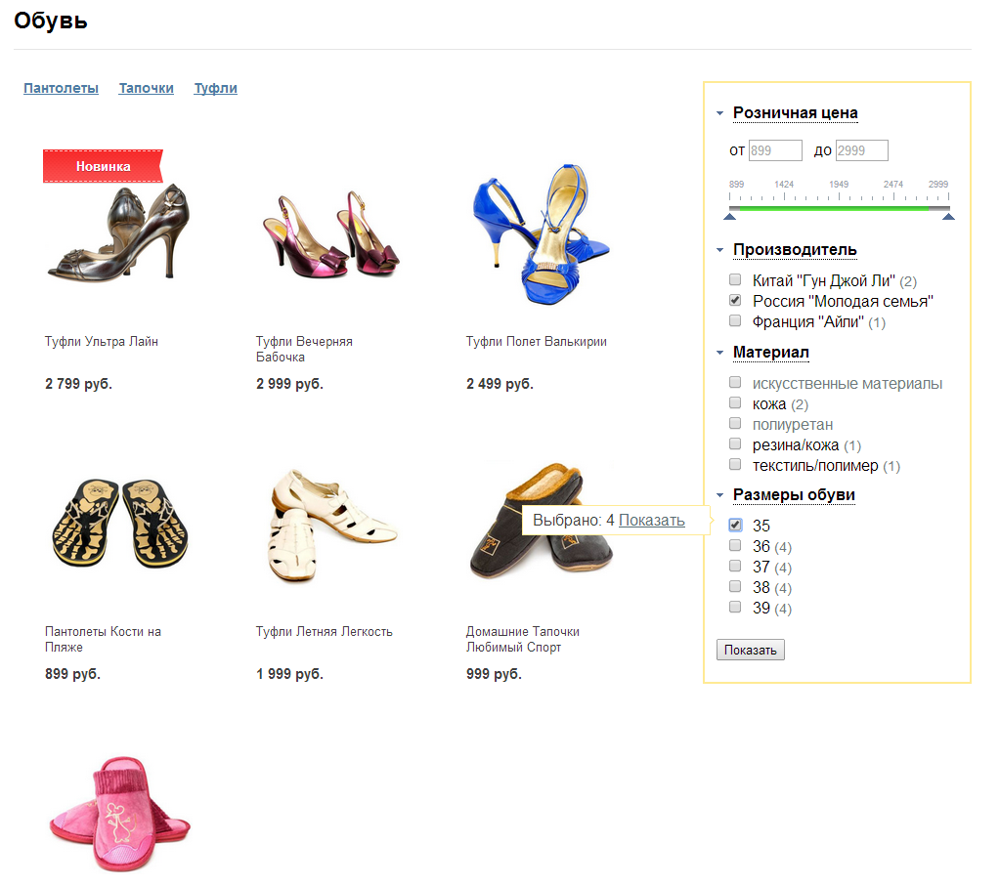
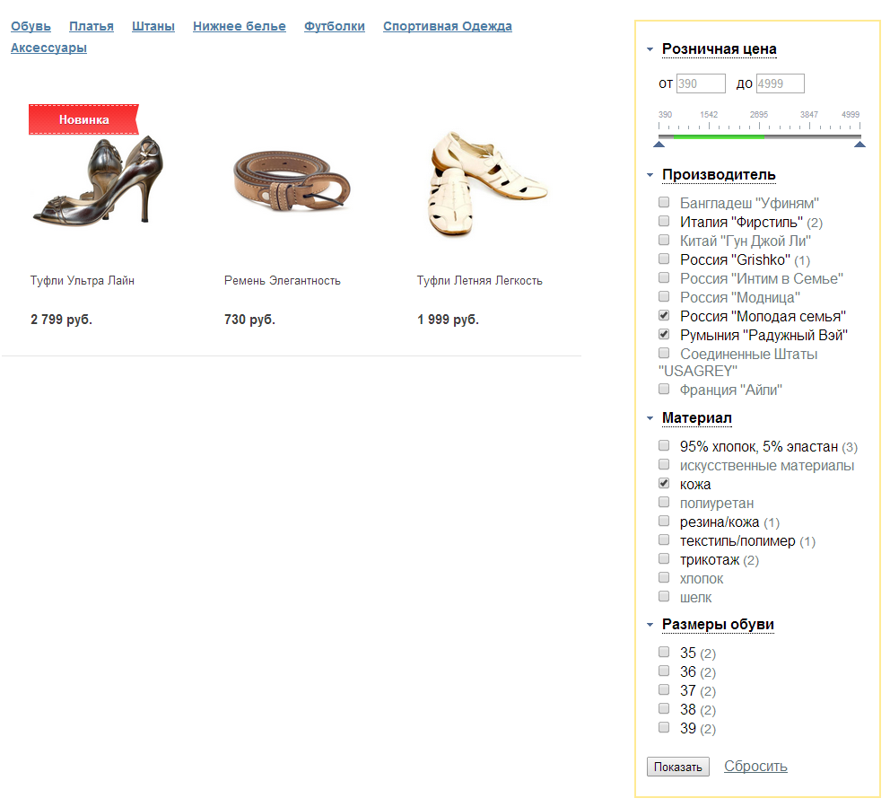

# Комплексный компонент каталога

Сейчас мы рассмотрим установку умного фильтра в каталоге, на примере стандартного интернет-магазина 1С-Битрикс. Так как у нас используется комплексный компонент каталога bitrix:catalog, то нам нужно отредактировать его шаблон (Что делать, если у вас не используется комплексный компонент?). В стандартном демо-магазине используется системный шаблон компонента каталога и чтобы его отредактировать его нужно предварительно скопировать в шаблон сайта. На вашем сайте скорее всего шаблон уже скопирован. Как это проверить? Переходим в любой раздел каталога, в моем случае это будет http://site.ru/catalog/shoes/.



Переходим в режим правки.



Наводим курсор мыши на компонент каталога (любой товар) и в появившейся панели управления выбираем в меню пункт «Редактировать шаблон компонента».



Тут возможны два случая. Если шаблон еще не скопирован, то вы увидите диалог копирования шаблона. В нем необходимо ввести имя нового шаблона и выбрать шаблон сайта. Здесь конечно все на ваше усмотрение, но я рекомендую дать осмысленное название шаблона и выбрать текущий шаблон сайта. Галочки «Применить новый шаблон компонента» и «Перейти к редактированию шаблона» должны быть отмеченными.



Нажимаем «Сохранить» и открывается окно редактирования шаблона.

Вы можете редактировать шаблон в нем, а можете перейти по ссылке Редактировать файл в панели управления и редактировать файл в панели управления, как вам удобно. Если у вас есть доступ к сайта через ftp/sftp то можете редактировать там.



Тут нужно быть внимательным, открыться должен файл шаблона section.php. Если открылся другой файл (например sections.php или element.php), то перейдите по ссылке Редактировать файл в панели управления, в хлебных крошках кликаем по ссылке с названием шаблона, откроется список файлов и в этом списке выбираем файл section.php и открываем его на редактирование как PHP.



В файле section.php находим строчки где вызывается штатный умный фильтр (у меня это строки 80-101):

**Если вы не нашли или в вашем шаблоне нет фильтра, что делать?**
Если у вас другой шаблон компонента каталога, и вы не нашли, то просмотрите весь файл section.php внимательно, возможно вызов фильтра располагается в другом месте. Если все-таки фильтра вообще нет, то тоже ничего страшного, нам тогда нужно найти вызов компонента bitrix:catalog.section, у меня это строки 161-247, начинаются они так:

```php
<?$APPLICATION->IncludeComponent(
  	"bitrix:catalog.section",
  	"",
  …
  ?>
```
Код очень длинный и нам он не интересен, главное что нам нужно знать, что фильтр обязательно должен располагаться до этого компонента, иначе он не будет фильтровать. Поэтому если вы не нашли фильтр, то находим компонент bitrix:catalog.section и где-нибудь выше него (в зависимости от дизайна или ваших предпочтений) вставляем код Kombox-фильтра (см. ниже)

```php
<?
$APPLICATION->IncludeComponent(
	"bitrix:catalog.smart.filter",
	"visual_".($arParams["FILTER_VIEW_MODE"] == "HORIZONTAL" ? "horizontal" : "vertical"),
	Array(
		"IBLOCK_TYPE" => $arParams["IBLOCK_TYPE"],
		"IBLOCK_ID" => $arParams["IBLOCK_ID"],
		"SECTION_ID" => $arCurSection['ID'],
		"FILTER_NAME" => $arParams["FILTER_NAME"],
		"PRICE_CODE" => $arParams["PRICE_CODE"],
		"CACHE_TYPE" => $arParams["CACHE_TYPE"],
		"CACHE_TIME" => $arParams["CACHE_TIME"],
		"CACHE_GROUPS" => $arParams["CACHE_GROUPS"],
		"SAVE_IN_SESSION" => "N",
		"XML_EXPORT" => "Y",
		"SECTION_TITLE" => "NAME",
		"SECTION_DESCRIPTION" => "DESCRIPTION",
		'HIDE_NOT_AVAILABLE' => $arParams["HIDE_NOT_AVAILABLE"],
		"TEMPLATE_THEME" => $arParams["TEMPLATE_THEME"]
	),
	$component,
	array('HIDE_ICONS' => 'Y')
);
?>
```

Вместо этого кода вставляем наш код:

```php
<?
$APPLICATION->IncludeComponent(
	"collected:filter", 
	"", //шаблон - .default (можно указать horizontal, bitronic-vertical или bitronic-horizontal)
	array(
		"IBLOCK_TYPE" => $arParams["IBLOCK_TYPE"],
		"IBLOCK_ID" => $arParams["IBLOCK_ID"],
		"FILTER_NAME" => $arParams["FILTER_NAME"],
		"SECTION_ID" => $arResult["VARIABLES"]["SECTION_ID"],
		"SECTION_CODE" => $arResult["VARIABLES"]["SECTION_CODE"],
		"HIDE_NOT_AVAILABLE" => $arParams["HIDE_NOT_AVAILABLE"],
		"CACHE_TYPE" => $arParams["CACHE_TYPE"],
		"CACHE_TIME" => $arParams["CACHE_TIME"],
		"CACHE_GROUPS" => $arParams["CACHE_GROUPS"],
		"SAVE_IN_SESSION" => "N",
		"INCLUDE_JQUERY" => "Y",
		"MESSAGE_ALIGN" => "LEFT",
		"MESSAGE_TIME" => "0",
		"IS_SEF" => "N",
		"CLOSED_PROPERTY_CODE" => array(),
		"CLOSED_OFFERS_PROPERTY_CODE" => array(),
		"SORT" => "N",
		"FIELDS" => array(),
		"PRICE_CODE" => $arParams["PRICE_CODE"],
		"CONVERT_CURRENCY" => $arParams["CONVERT_CURRENCY"],
		"CURRENCY_ID" => $arParams["CURRENCY_ID"],
		"XML_EXPORT" => "Y",
		"SECTION_TITLE" => "NAME",
		"SECTION_DESCRIPTION" => "DESCRIPTION",
        "PAGER_PARAMS_NAME" => $arParams["PAGER_PARAMS_NAME"]
	),
	false
);
?>
```

Более подробно прочитать про параметры фильтра можно тут. В стандартном демо-магазине библиотека jquery не поключена, поэтому я указал параметр INCLUDE_JQUERY = Y, чтобы фильтр сам подключил jquery, если на вашем сайте она подключена, то следует указать INCLUDE_JQUERY = N иначе могут быть ошибки. Сохраняем файл и смотрим результат. Должно получиться следующее:



Все работает? Если что-то не работает, то пытаемся разобраться.

Если вы хотите, чтобы фильтр работал в корне каталога, то нужно отредактировать файл шаблона sections.php. В нем нет фильтра, поэтому добавляем вызов компонента Kombox-фильтр. Но добавить фильтр мало, на этой странице используется компонент bitrix:catalog.top и он не поддерживает фильтрацию, поэтому нам нужно его удалить и на его место вставить компонент bitrix:catalog.section, лучше скопировать код этого компонента из файла section.php с которым мы уже работали.

Есть несколько важных моментов. Так как это корень каталога, то у компонента Kombox-фильтра и bitrix:catalog.section удаляем параметры SECTION_ID и SECTION_CODE, они не нужны. Для компонента bitrix:catalog.section добавляем параметр SHOW_ALL_WO_SECTION = Y, чтобы он выводил товары из всех разделов.

Конечный код файла может сильно отличаться в зависимости от вашего шаблона, дизайна сайта и т.д. Можете скачать [мой код для примера](examples/sections.php). Вот что у меня получилось в итоге:

