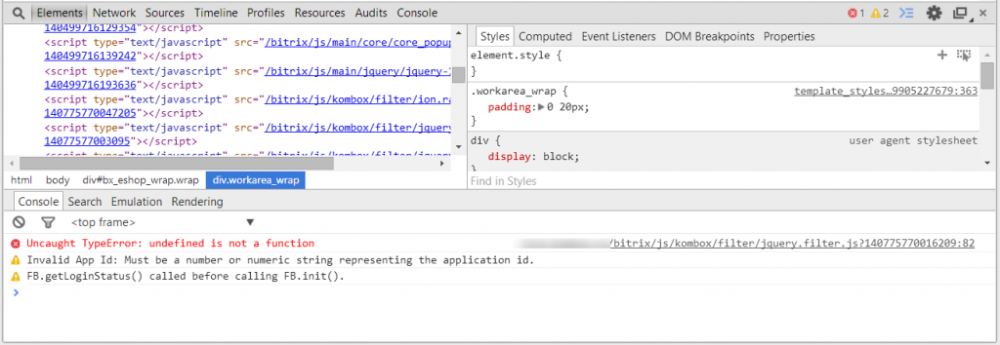
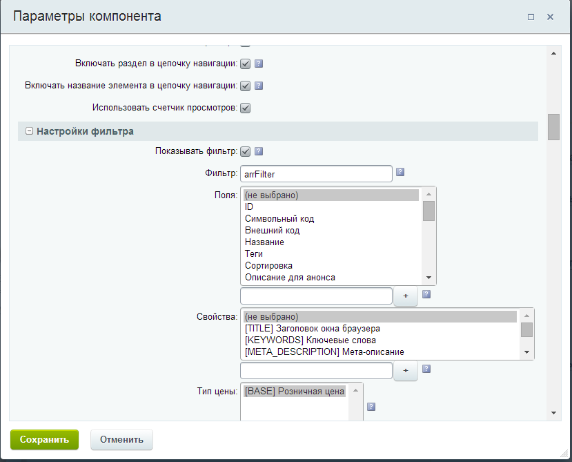

# Частые ошибки

Если вы сделали все по инструкции, а фильтр не работает, то вот вам перечень самых частых ошибок.

**Не подключен jquery**
Для работы фильтра необходима библиотека jquery, если у вас на сайте ее нет, то следует ее подключить в шаблоне сайта, лучше через функцию CJSCore::Init(array("jquery")); либо можете указать параметр компонента фильтра INCLUDE_JQUERY = Y

**Подключено два jquery**
Бывает так, что в шаблоне сайта подключено две (три, четыре) версии jquery, из-за этого js-код фильтра может не работать и может работать не правильно. Обычно ошибка в таком случае выглядит примерно так (смотрите в консоли Google Chrome):



В этом случае нужно избавится от лишнего подключения jquery. В идеале следует подключать системную jquery вот так:

`CJSCore::Init(array("jquery"));`

**Ошибка javascript**
Так же следует убедится что нет других js-ошибок, иногда какая-то ошибка прерывает выполнение javascript.

**Не указан параметр FILTER_NAME у компонента catalog.section**
У компонента catalog.section обязательно нужно указать параметр FILTER_NAME – имя фильтра (обычно arrFilter), если вы используете комплексный компонент каталога bitrix:catalog, то аналогичный параметр следует указать у него.



**На странице оставлен старый умный фильтр**
Как ни странно, но очень популярная ошибка. При установке вам обязательно нужно удалить или закомментировать старый умный фильтр (bitrix:catalog.smart.filter), если он есть на странице, вместе они не будут корректно работать.

Комментировать необходимо через php - комментарии:

```php
<?
/*
код
*/
?>
```

Если вы закомментируете через html-комментарии:

```html
<!--
код
-->
```

То хоть фильтр и не будет отображаться, он все равно будет вызываться и мешать Kombox-фильтру.

**Ошибка Fatal error: Class 'DOMDocument' not found in /home/bitrix/www/bitrix/modules/kombox.filter/include.php на странице редактирования настроек свойства инфоблока.**

В этом случае нужно на хостинге установить расширение php dom.so