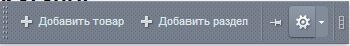
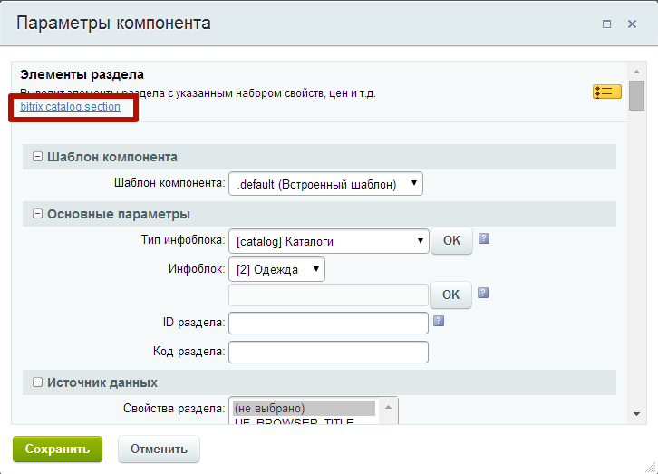

# Я хочу, чтобы фильтр работал только в каталоге

На сайте может использоваться комплексный компонент каталога, либо простые компоненты, проверить это очень легко. Переходим в каталог, в любой раздел. Переходим в режим правки, наводим курсор мыши на любой товар и вызываем диалог настроек компонента, кликая по иконке с шестеренкой:

Откроется диалог настроек компонента

В открывшемся диалоге вы сможете увидеть какой компонент используется на странице, если это bitrix:catalog.section или bitrix:catalog.detail, то значит на вашем сайте не используется комплексный компонент каталога, а если bitrix:catalog, то на сайте используется комплексный компонент.

Если на сайте используется комплексный компонент, то про установку читаем [здесь](help/complex_filter_catalog.md), если не используется то здесь.