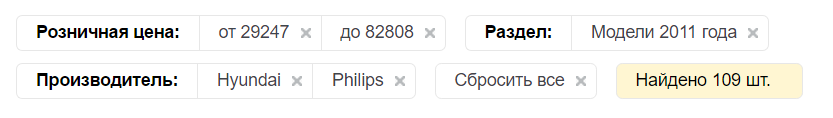

# Блок "Ваш выбор"

Блок "Ваш выбор" - это вывод выбранных значений свойств фильтра. Его можно вывести в любом месте, чтобы пользователь видел по каким параметрам отфильтрованы товары и быстро мог отменить какие-то значения. Актуально для фильтров с большим количеством свойств. Данный блок так же работает в [режиме ajax](select.md).



Вывести этот блок можно в любом месте на странице с фильтром (в шапке, в подвале, в сайдбаре, даже до вывода самого фильтра). Для этого в нужном вам месте разместите код:

```php
<?
$APPLICATION->ShowViewContent('kombox-filter-choice');
?>
```
