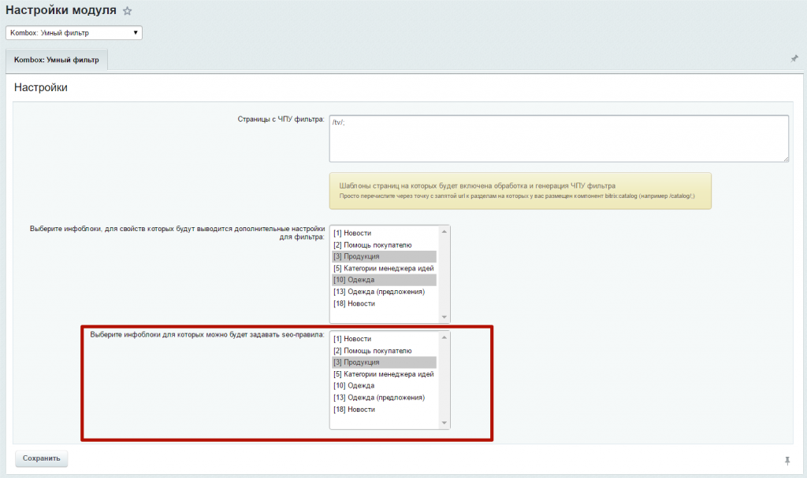
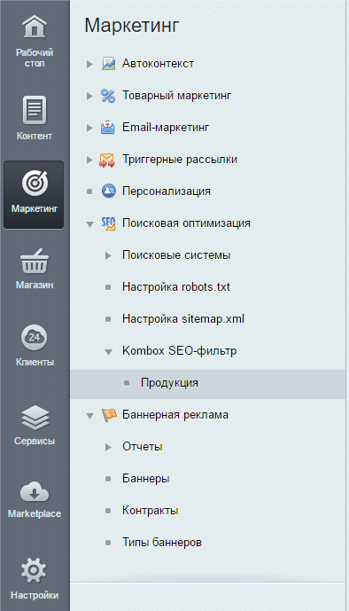
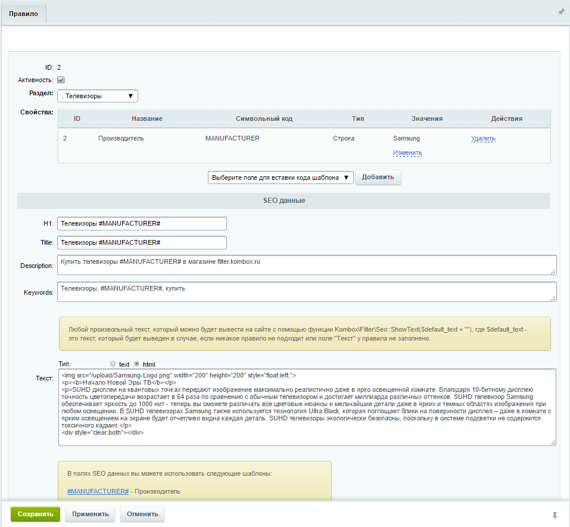
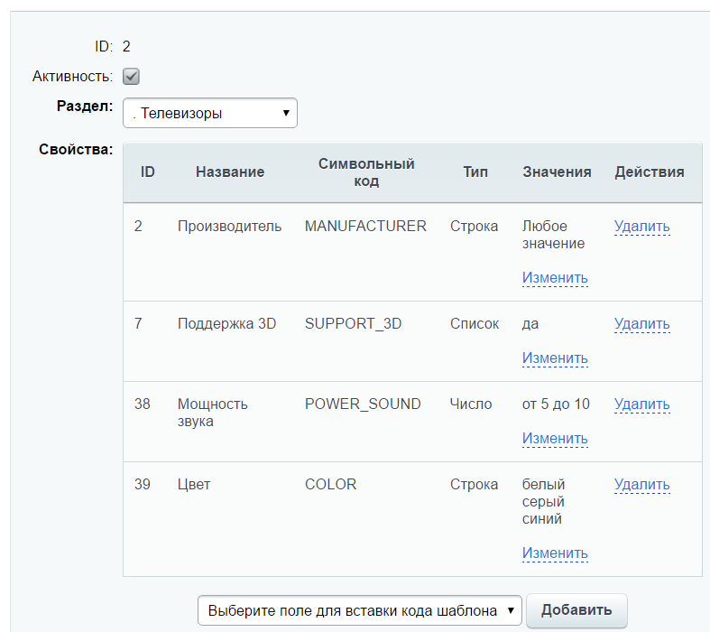
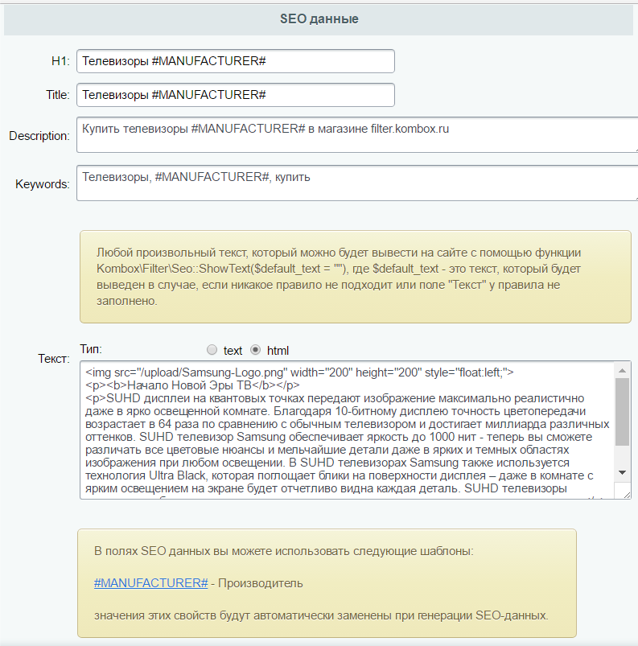

# SEO

**Важно!**
Чтобы работало SEO-фильтра, все seo-теги должны выводиться штатными функциями:
H1 - $APPLICATION->ShowTitle(true)
Title - $APPLICATION->ShowTitle()
Keywords - $APPLICATION->ShowMeta("keywords", false, true);
Description - $APPLICATION->ShowMeta("description", false, true);

Для того, чтобы задавать значения мета-тегов для страниц фильтра, вам нужно в настройках модуля фильтра выбрать инфоблок(и), для которых вы будете создавать правила.

Для этого в административном разделе переходим в Рабочий стол/Настройки/Настройки продукта/Настройки модулей/Collected: Умный фильтр



После этого в разделе Маркетинг/Поисковая оптимизация/Kombox SEO-фильтр появятся выбранные инфоблоки и можно будет создавать правила.



Правило - это набор свойств и их значений, которые должны быть заданы в фильтре, чтобы указанные значения мета-тегов были выведены на странице.

Пример правила:



Данное правило будет применяться, если в фильтре будет выбран производитель Samsung. Значение свойства указывать не обязательно, может быть любое значение. Можно указать несколько свойств, в том числе числовые. Например правило может быть таким:



Так же нужно указать раздел инфоблока, к которому будет применяться данное правило, либо это может быть весь инфоблок.

Далее нужно указать значения для мета-тегов.



Можно задавать значения явно,а можно использовать шаблоны для выбранных свойств, которые при отображении будут заменены на выбранные значения.

Т.е. H1 заданный как "Телевизоры #MANUFACTURER#", при выборе производителя Samsung будет выведен как "Телевизоры Samsung".

Отдельно стоит рассказать, про поле "Текст". Здесь можно указать любой произвольный текст, в том числе в html формате, который можно вывести в любом месте страницы. Для этого нужно разместить в нужном месте такой код:

```php
<?
if(CModule::IncludeModule('collected.filter')){
	echo Collected\Filter\Seo::ShowText("");
}
?>
```
