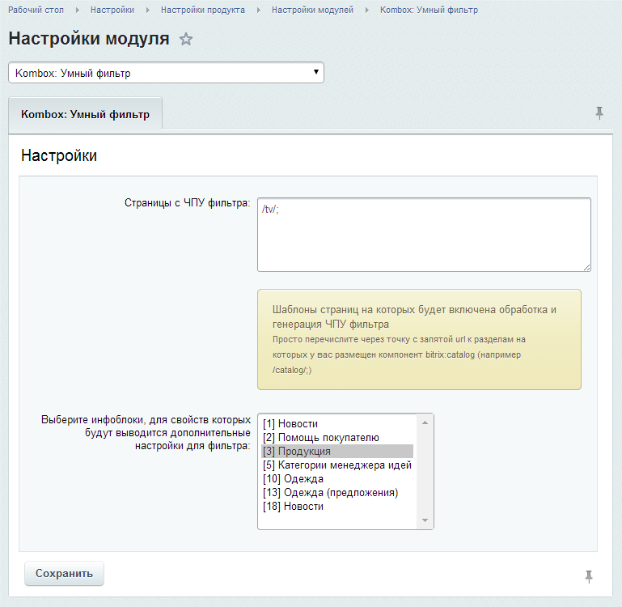
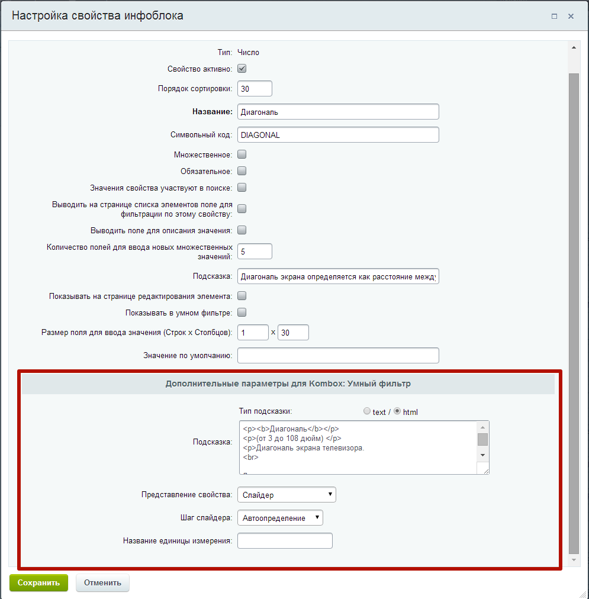

# Настройки модуля

Страница с настройками модуля выглядит следующим образом:

В настройках есть два параметра:

Страницы с ЧПУ фильтра - шаблоны страниц на которых будет включена обработка и генерация ЧПУ фильтра. В этом параметры следует указать url от корня сайта к тем разделам сайта, в которых фильтр будет работать в режиме ЧПУ (если таких разделов несколько, то следует их перечислить через точку с запятой).

Выберите инфоблоки, для свойств которых будут выводится дополнительные настройки для фильтра - в этом параметре следует указать инфоблоки, для свойств которых будут выводится дополнительные настройки фильтра (чтобы выбрать несколько инфоблоков, выделяйте их с зажатой клавишей Ctrl). Для свойств выбранных инфоблоков форма настроек будет выглядет вот так:

Чтобы открыть окно настроек свойства инфоблока, перейдите в настройки нужного вам инфоблока, откройте вкладку Свойства и кликнете по кнопке кнопка рядом с нужным вам свойством.