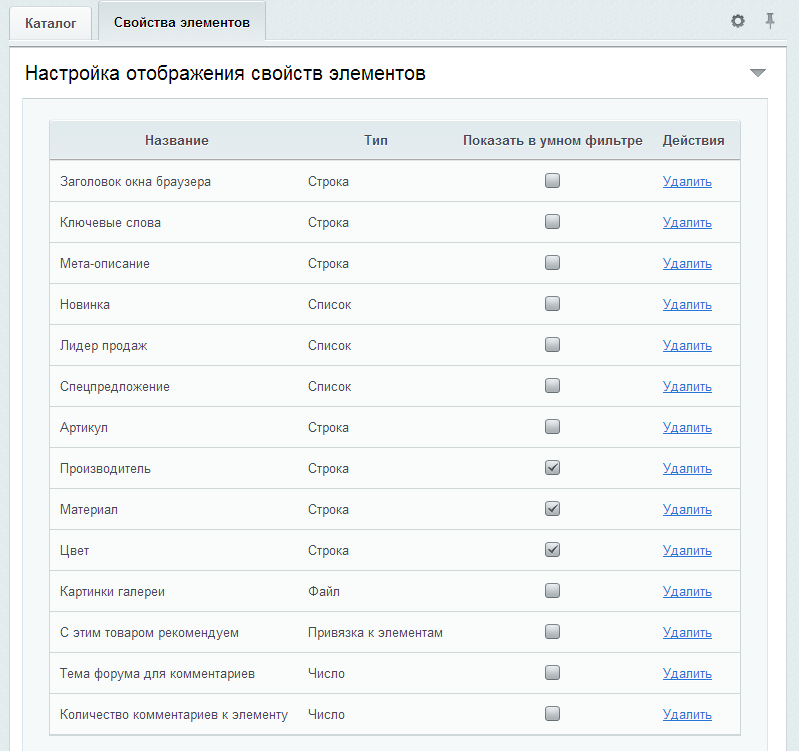
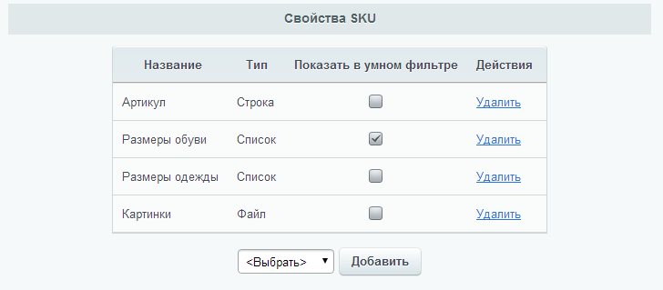
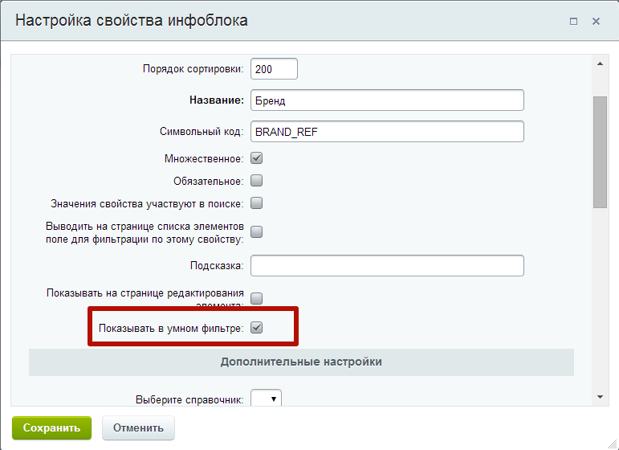

# Настройка свойств

Предварительно следует настроить отображение необходимых свойств в умном фильтре. Если инфоблок является торговым каталогом, то свойства можно добавить в через радел Магазин административного раздела, заходим в нужный инфоблок и выбираем пункт меню Настройки каталога. На вкладке Свойства элементов следует у нужных свойств отметить галочку Показать в умном фильтре. В результате должно получится например так:

Если необходимо здесь же настраиваем свойства SKU.

Если инфоблок не является торговым каталогом, то чтобы свойство отображалась в фильтре следует отметить галочку Показывать в умном фильтре.

Теперь нам необходимо разместить компонент фильтра.