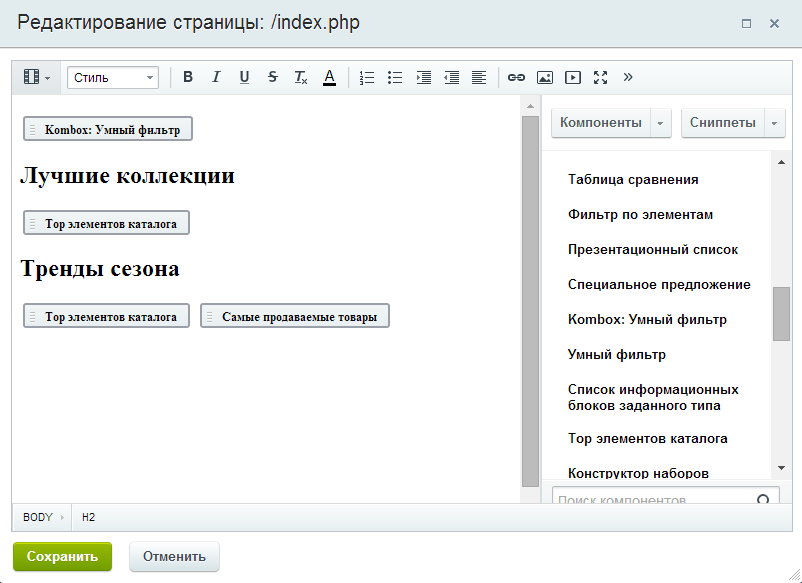
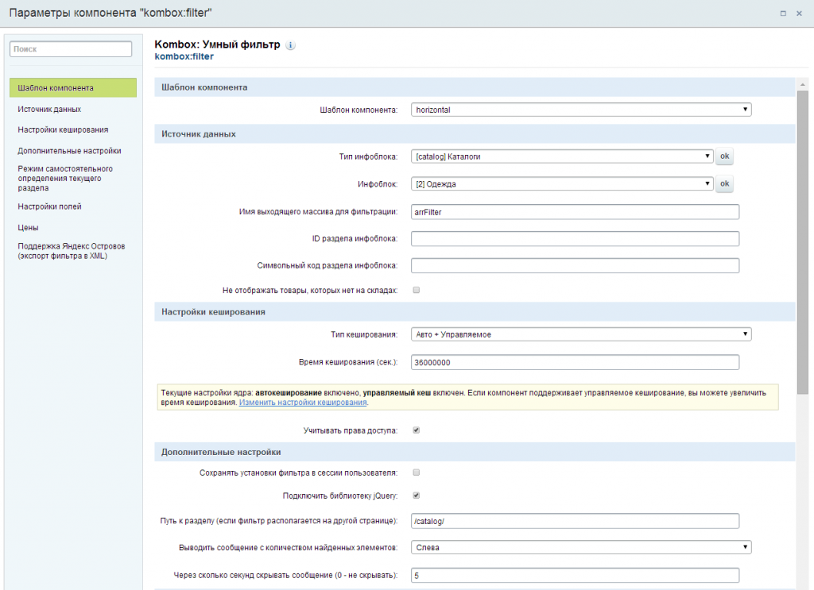
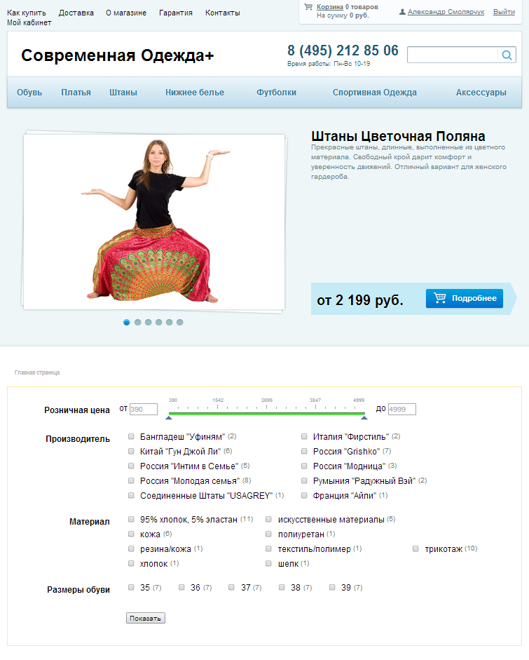

# Я хочу, чтобы фильтр работал только на отдельной странице (например, на главной)

Рассмотрим случай, если вам нужно чтобы фильтр работал на отдельной странице сайта, и при клике по кнопке показать переходил на другую страницу с результатами фильтрации. Например, пусть фильтр будет на главной странице сайта. Для этого просто открываем главную страницу в визуальном редакторе и добавляем компонент Kombox: Умный фильтр и настраиваем его.

В параметрах не нужно указывать параметры ID раздела инфоблока и Символьный код раздела инфоблока, и обязательно нужно указать параметр Путь к разделу, в этом параметре нужно указать путь к странице, на которую будет переходить фильтр. На этой странице должен быть расположен и настроен компонент bitrix:catalog.section. У меня это будет корень каталога /catalog/ (как его сделать и настроить). Сохраняем страницу. На главной странице должен отобразиться фильтр.

Если что-то не работает, то пытаемся разобраться.